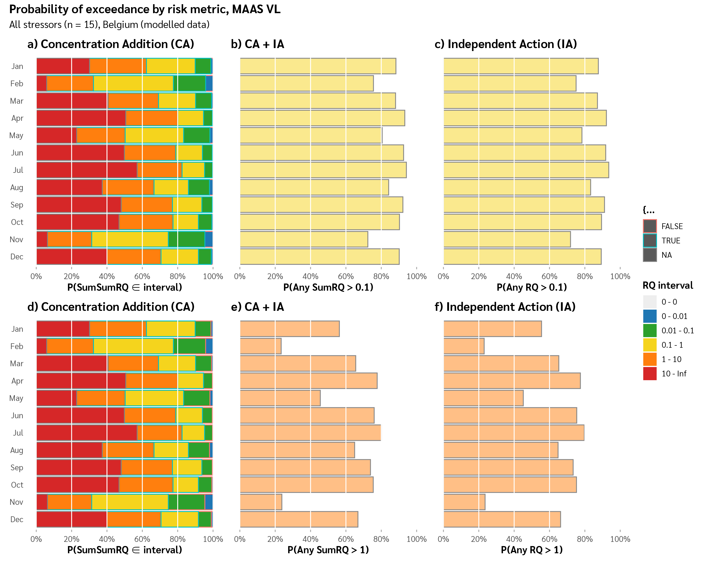

Graphics made from BN output for the ENCORE project.

```{r, include = FALSE}
knitr::opts_chunk$set(
  collapse = TRUE,
  comment = "#>"
)
```

# Code Files

`_RUNME.R`, Loads packages and runs all figure generation scripts

`load_data.R` - Load datafile and pivot longer

`fct_parse_nodes.R` - Parse node names into categorical variables

`format_data.R` - Join lookups of pretty names and prepare for plotting

`merge_intervals.R` - Merge from 12 to 6 RQ intervals

`themes.R` - Common colour, axis scales and theming for graphs

`make_fig1.R`, Generate individual stressor risk quotient probability distributions by RBD

`make_fig2.R`, Generate grouped stressor comparison visualisations

`make_fig3.R`, Generate multiple risk metrics comparison charts

# Figure 1 - All RBDs


# Figure 2


# Figure 3


