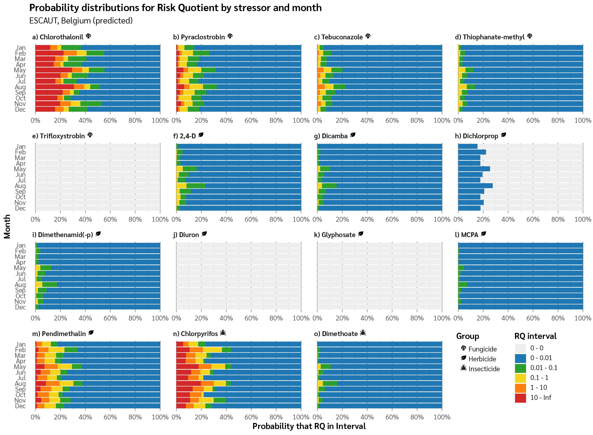
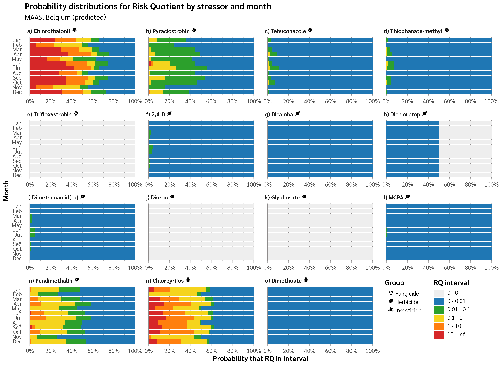
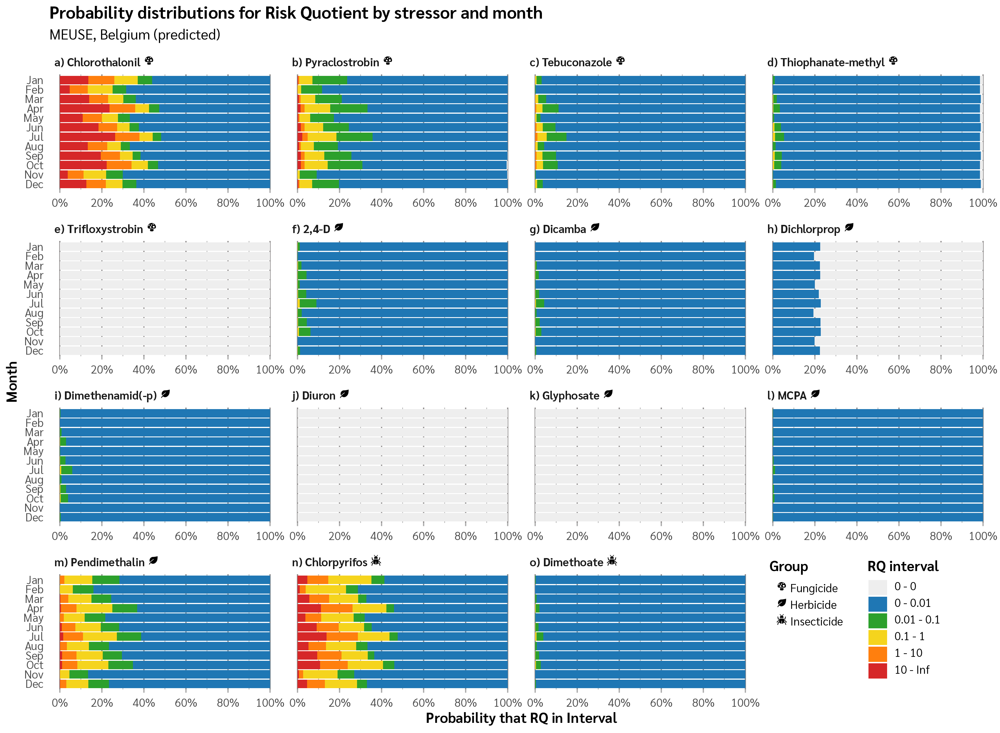
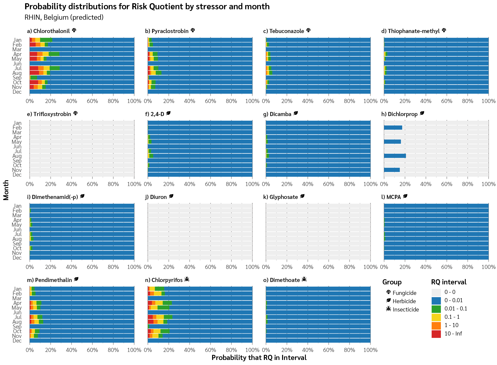
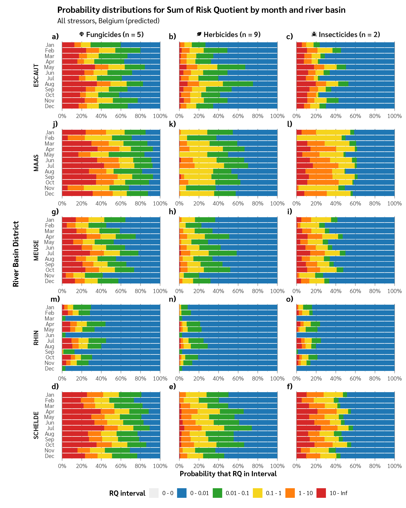
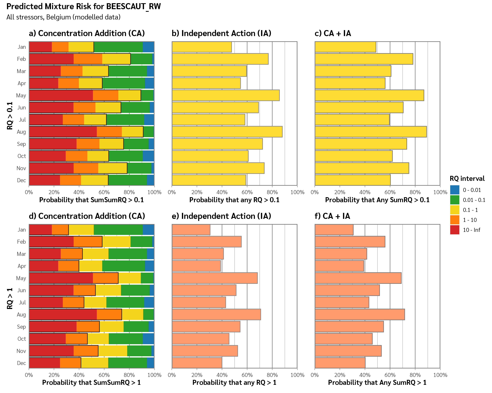
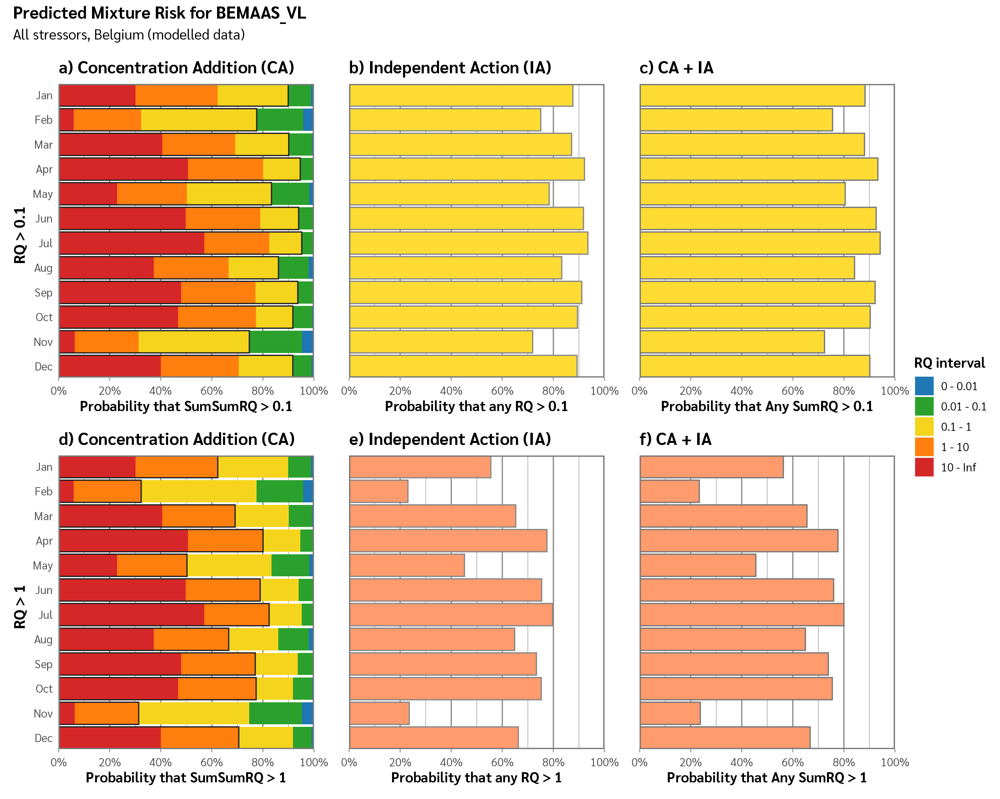
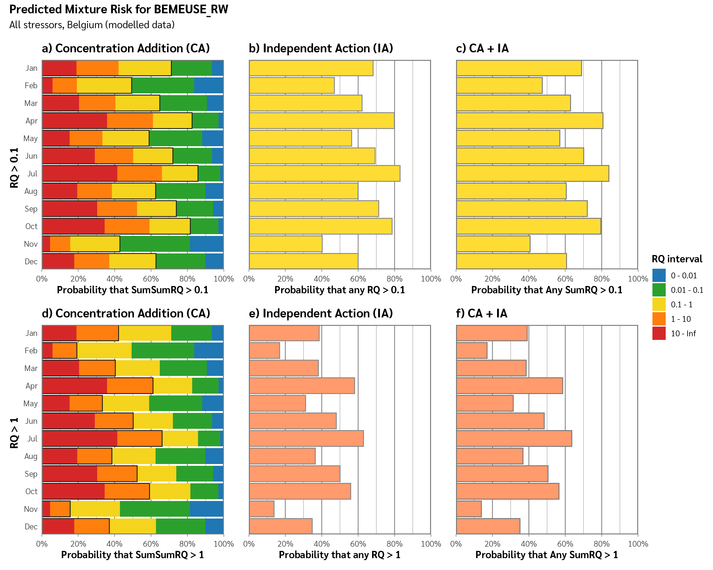
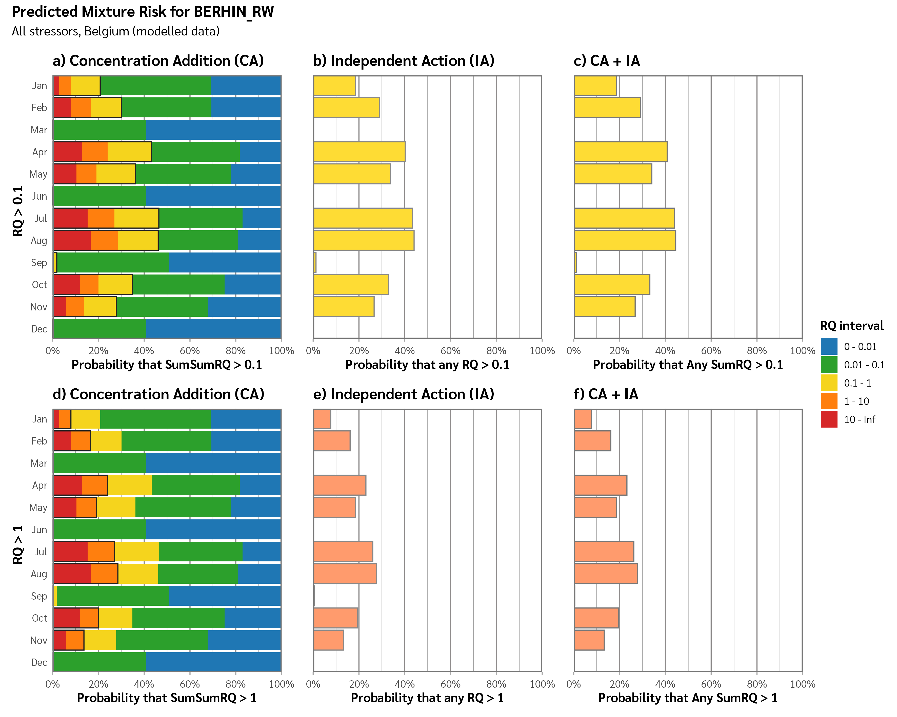
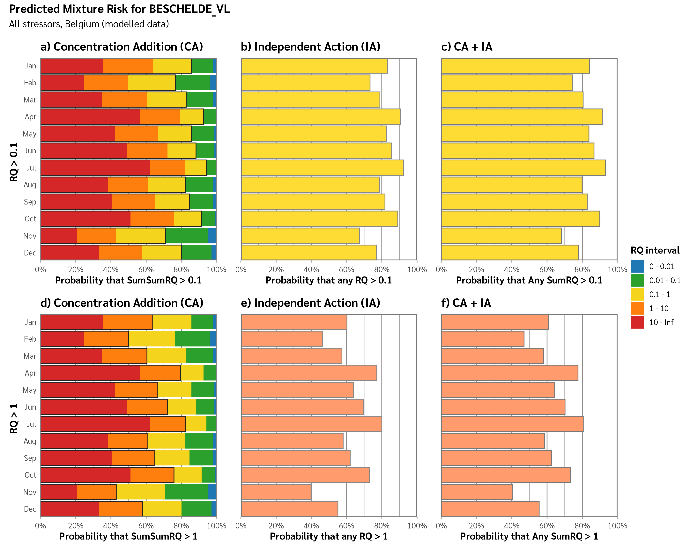

Graphics made from BN output for the ENCORE project.

# Code Files

`_RUNME.R`, Loads packages and runs all figure generation scripts

`load_data.R` - Load datafile and pivot longer

`fct_parse_nodes.R` - Parse node names into categorical variables

`format_data.R` - Join lookups of pretty names and prepare for plotting

`merge_intervals.R` - Merge from 12 to 6 RQ intervals

`themes.R` - Common colour, axis scales and theming for graphs

`make_fig5.R`, Generate individual stressor risk quotient probability
distributions by RBD

`make_fig6.R`, Generate grouped stressor comparison visualisations

`make_fig7.R`, Generate multiple risk metrics comparison charts

# Figure 5 (All RBDs)

<figure>

<figcaption aria-hidden="true">Figure 5a</figcaption>
</figure>

<figure>

<figcaption aria-hidden="true">Figure 5b</figcaption>
</figure>

<figure>

<figcaption aria-hidden="true">Figure 5c</figcaption>
</figure>

<figure>

<figcaption aria-hidden="true">Figure 5d</figcaption>
</figure>

<figure>

<figcaption aria-hidden="true">Figure 5e</figcaption>
</figure>

# Figure 6

<figure>

<figcaption aria-hidden="true">Figure 6</figcaption>
</figure>

# Figure 7 (All RBDs)

<figure>

<figcaption aria-hidden="true">Figure 7a</figcaption>
</figure>

<figure>

<figcaption aria-hidden="true">Figure 7b</figcaption>
</figure>

<figure>

<figcaption aria-hidden="true">Figure 7c</figcaption>
</figure>

<figure>

<figcaption aria-hidden="true">Figure 7d</figcaption>
</figure>

<figure>

<figcaption aria-hidden="true">Figure 7e</figcaption>
</figure>
