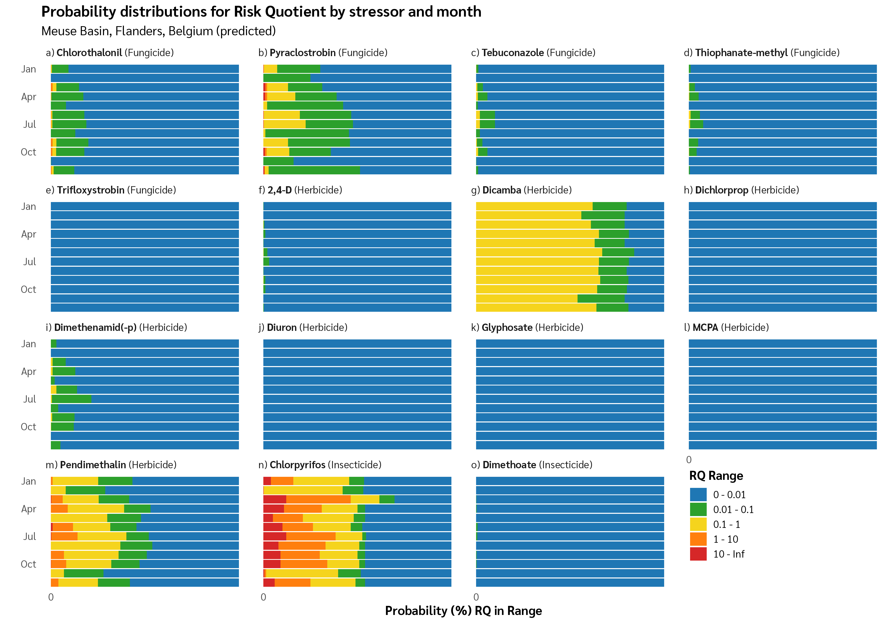
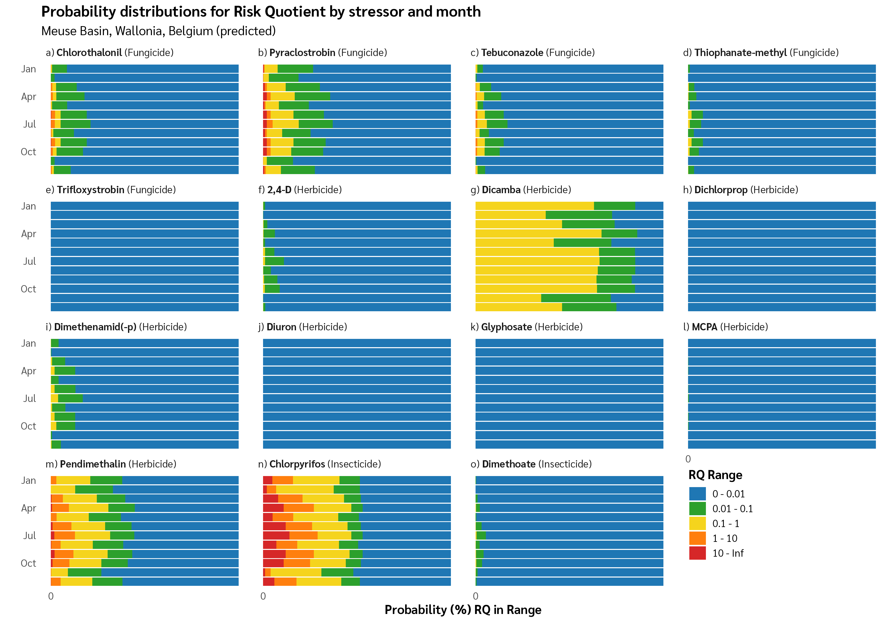
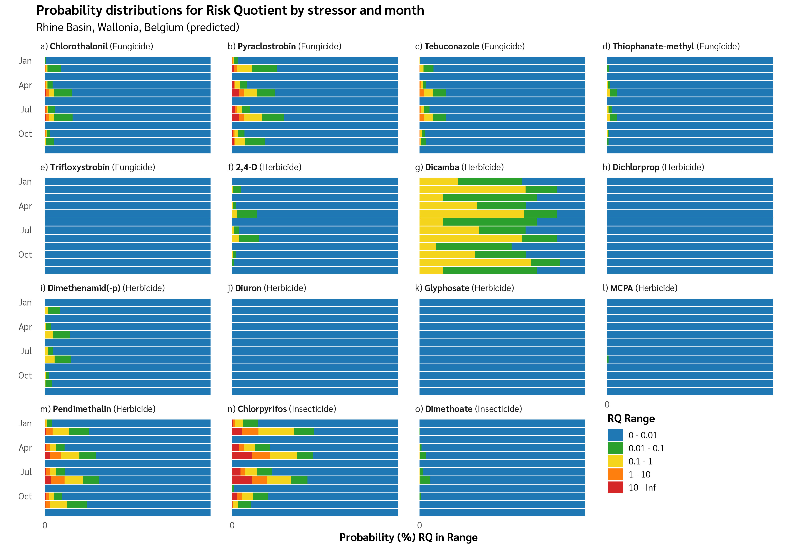
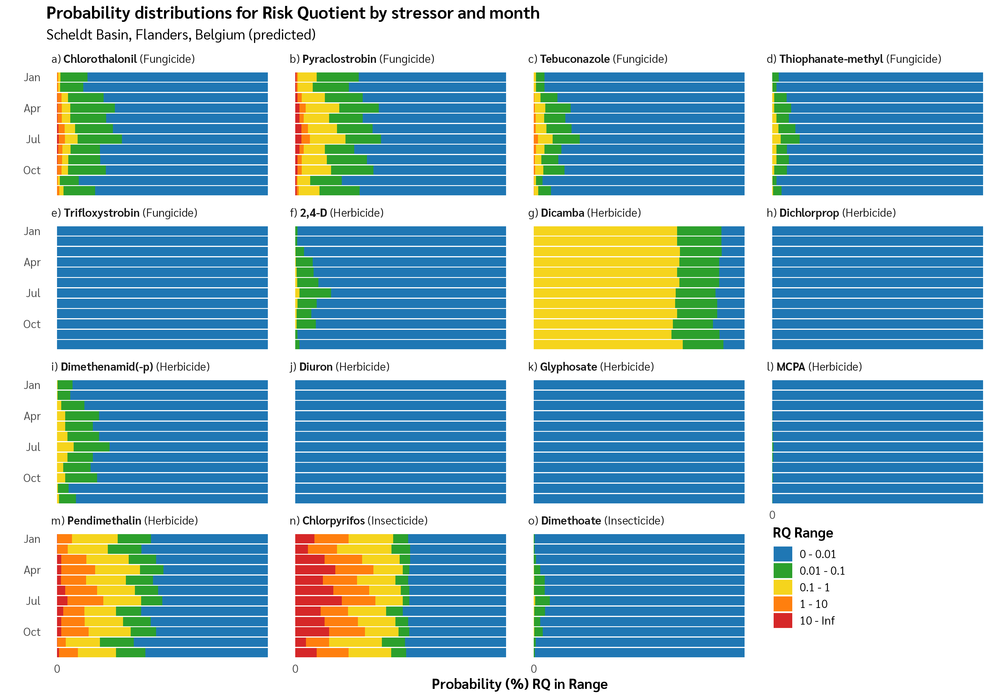
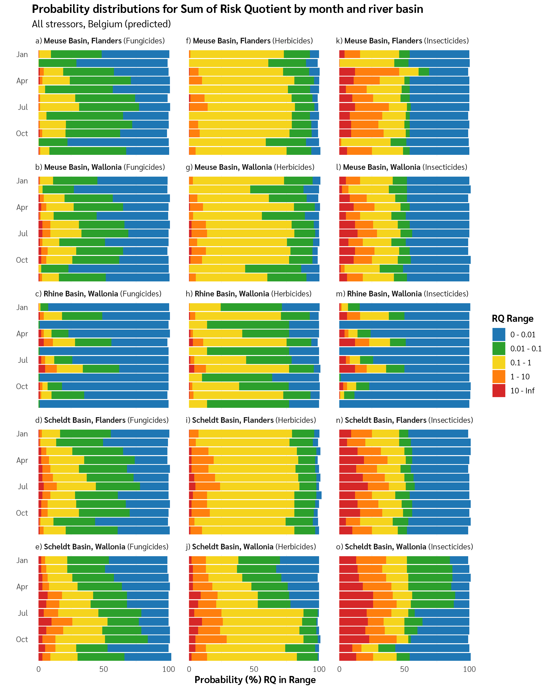
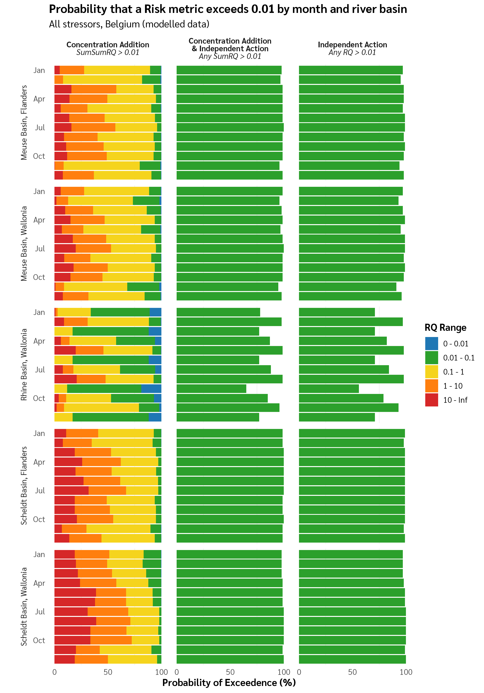
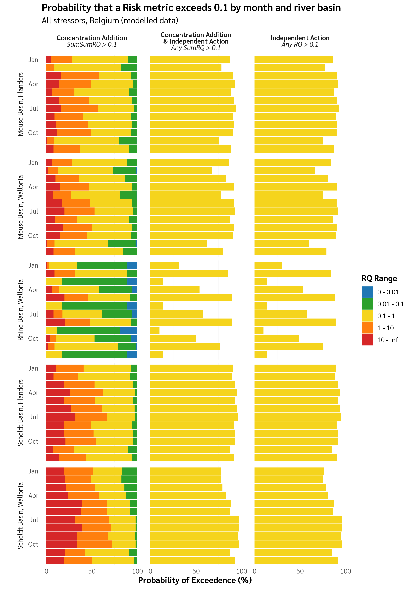
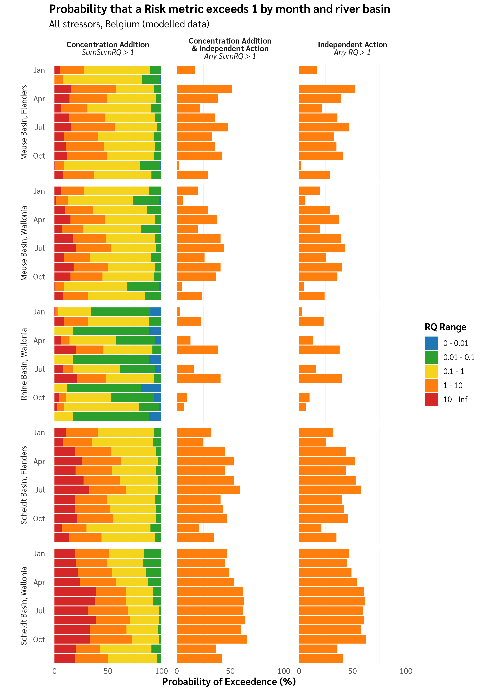
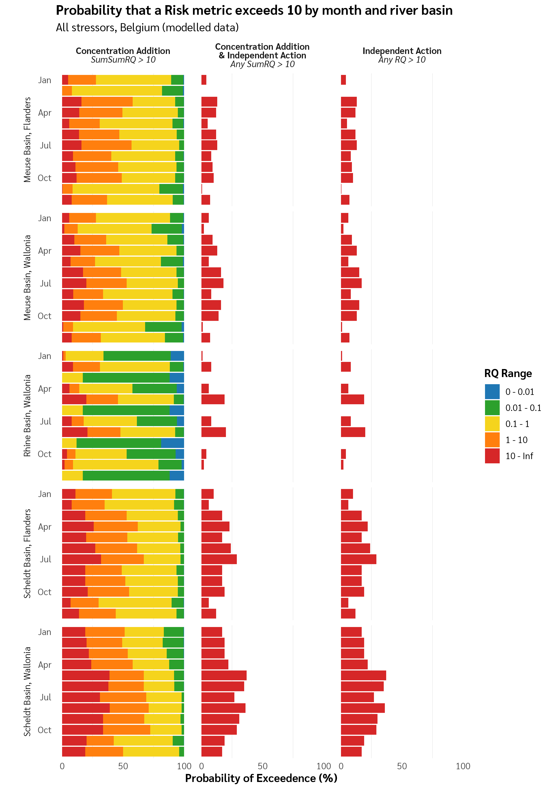

Graphics made from BN output for the ENCORE project.

# Code

``` r
r_files <- list.files("R", pattern = "\\.R$", full.names = FALSE)

r_descriptions <- tribble(
  ~file, ~description,
  "make_fig1.R", "Generate individual stressor risk quotient probability distributions by RBD",
  "make_fig2.R", "Generate grouped stressor comparison visualizations",
  "make_fig3.R", "Generate multiple risk metrics comparison charts",
  "_RUNME.R", "Loads packages and runs all figure generation scripts"
)

r_files_df <- tibble(file = r_files) |>
  left_join(r_descriptions, by = "file") |>
  mutate(description = coalesce(description, ""))

r_files_df |>
  glue_data("- **{file}**: {description}") |>
  paste(collapse = "\n")
#> [1] "- **_RUNME.R**: Loads packages and runs all figure generation scripts\n- **format_data.R**: \n- **load_data.R**: \n- **make_fig1.R**: Generate individual stressor risk quotient probability distributions by RBD\n- **make_fig2.R**: Generate grouped stressor comparison visualizations\n- **make_fig3.R**: Generate multiple risk metrics comparison charts\n- **themes.R**: "
```

# ENCORE-Graphs

``` r
image_files <- list.files("images", pattern = "\\.png$", full.names = FALSE)

image_files |>
  map_chr(function(img) {
    glue("")
  }) |>
  paste(collapse = "\n\n")
#> [1] "\n\n\n\n\n\n\n\n\n\n\n\n\n\n\n\n\n\n"
```
